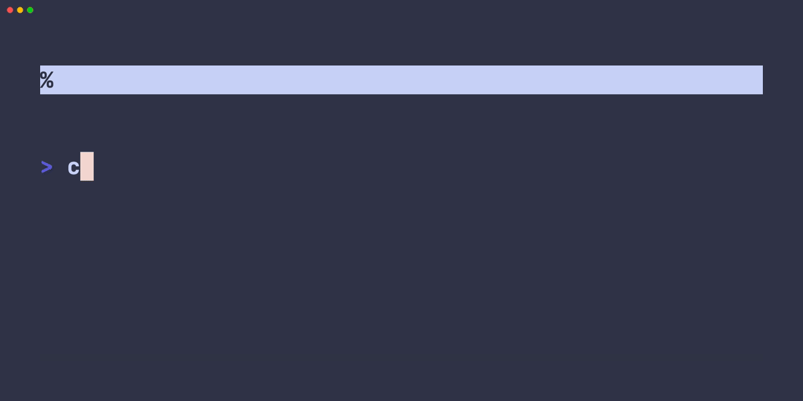

# Slingshot

Slingshot is a lightweight and minimal tool to intuitively navigate across folders in the terminal. It allows the user to quickly filter through files in any directory, and open them with a text editor (nvim by default).

# Design Goals
- A quick way to navigate to programming projets, without having to type the entire path.
- Easily maintanable.
- Minimal use of third party crates.

